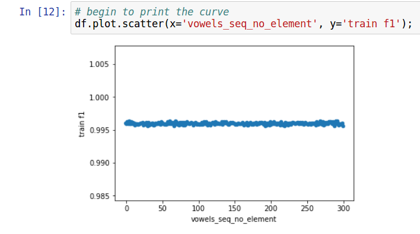
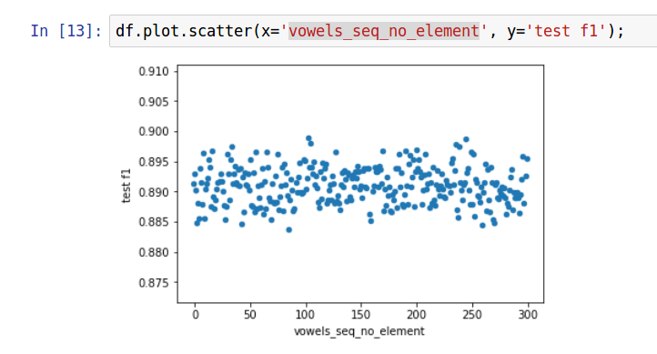

# Project: Predict Stress in English Words

##  一、参与成员：
邱兆丰(15331260)
谢轩(15310053)
罗剑杰(15331229)(组长)

## 二、What features we use in our classifier

### 最终选择的features
对于一个单词，选择下面的4个features

1. 元音序列
2. 辅音+元音组合序列
3. 元音个数
4. 特定前缀

###  Why they are important and what information we expect them to capture

1. **元音个数**：通过对于英语重音的常识理解和对相关知识的查询，可以知道，元音的个数对于重音的判断也有相应的帮助。
4. **特定前缀**：通过对于英语重音的常识理解和对相关知识的查询，可以知道，一些特定前缀如'st'等后直接上重音。
1. **元音序列**：仅仅只是知道元音序列还不太足够，如果知道是什么元音，并且元音在发音里面的顺序是如何的话，会有极大的帮助。
2. **辅音+元音组合**：为了**把辅音的信息也用上**，粗略对`training_data`训练集进行统计，发现一些特定的辅音+元音的组合会十分频繁地出现。如`W IH1`这个组合，当`W IH`这个组合出现的时候有挺大机率是`IH`这个音发primary stress。因此想要通过这个feature来抓住发音的一些组合规律的信息。

实验过程中有尝试过其他的features，不过后来通过不断实验得出的f1综合舍弃。具体优化下文有涉及。

### 具体实现与表现形式

首先，为了节约内存空间，我们会把所有音标都map到[0,38]唯一的一个int数字标志。

1. **元音个数**：int， 占用feature matrix的一列
2. **特定前缀**：int，提供一个前缀表，如果单词的前缀可以在前缀表中找到，则返回前缀在表中的index。如果没有找到，则返回-1.
3. **元音序列**：一开始想使用元组，但是实现途中发现调用的sklearn接口，需要是长度一定的，可以转成float64的matrix features。想了一个办法，因为有前提条件是元音数小于5个，所以直接给feature matrix的4个列分别表示对应顺序具体是哪个元音的数字标志，如果没有该元音，则赋值为-1
4. **辅音+元音组合**：每个组合内的最后一个必定是元音，那么也可以给4个特定的列。如何表示出辅音+元音的序列关系呢？我们组使用tuple到int的一个哈希，每两位表示一个音标的数字标志，一次体现出顺序关系。eg. [L, ER, N, IH, NG] -> [25, 7, 27, 9, 28] -> [(25,7), (27,9)]->[2507, 2709]->[2507, 2709, -1,-1]

### feature探寻过程

本次实验所给的数据项较为简单，而对于本次数据的特征更多是需要我们自己去挖掘，因为数据和特征决定了数据挖掘与机器学习的上限，模型和算法只是逼近这个上限的方法，所以可见本次实验预测的准测度很大程度上是取决于特征的挖掘与选择上的。而且，由于特征需要我们去构造，在维数不大的情况下，基本不需要用到降维，规格化等技术，而特征提取后，预处理可能需要处理noise和特征缺失之类的问题。

#### 实验思路

按照提交的要求实现`submission.py`,然后通过实现不同的顶层调用模块去对submission进行评估。如，
- 使用`standard_test.py`完全模拟线上评测系统的评测流程
- 使用`random_test.py`来对于特定的features matrix 和 classifier , 使用训练集来进行cross_validation检测，实验300次取每次f1的平均值来进行评估和优化。
- 使用`classifiers_test.py`来对于特定的features matrix, 使用不同的classifier来进行cross_vallidation检测，取各自平均f1来确定选择哪种分类器最佳。

依靠这些顶层模块可以将精力集中与features的选择与构建的部分上，提高了效率。

#### 测试过的特征
一开始通过网络调研以及对训练集数据的观察，初步拟出下列features

1. 元音个数 *
2. 前缀 *
3. 后缀
4. 音标个数
5. 单词长度
6. 元音序列（将元音字符串映射成整形序列） *
7. 音标序列（将音标字符串映射成整形序列）
8. 音标组合 *

然后我们实现了整个project的框架之后，通过调整特征提取函数的内部实现，来测试不同的features组合的f1，从而选出比较有效的features（星号feature）。如，实验发现后缀的影响较小等等。

## 三、模型研究与选择

下面是`classifiers_test.py`的核心代码：

```python
# 在这里提取出想要的特征矩阵features和对应的分类数组labels数组
features, labels = training_preprocess(raw_data)

clf1 = tree.DecisionTreeClassifier(criterion='gini')
clf2 = tree.DecisionTreeClassifier(criterion='entropy')
clf3 = sklearn.naive_bayes.GaussianNB()
clf4 = sklearn.naive_bayes.BernoulliNB()
clf5 = LogisticRegression()
clf6 = neighbors.KNeighborsClassifier(algorithm='kd_tree')

clfs = [('gini_dtree', clf1), ('entr_dtree',clf2), ('GaussianNB', clf3), ('BernoulliNB', clf4), 
('LogisticRegression',clf5), ('kd_tree', clf6)]

res = []
for clf in clfs:
    train_f1_li = []
    test_f1_li = []
    for i in range(300):
        print (clf[0], ' tries ', i, ' times.')
        x_train, x_test, y_train, y_test = train_test_split(features, labels, test_size = 0.2)
        clf[1].fit(x_train, y_train)

        answer = clf[1].predict(x_train)
        answer2 = clf[1].predict(x_test)

        train_f1_li.append(f1_score(y_train, answer, average='micro'))
        test_f1_li.append(f1_score(y_test, answer2, average='micro'))

    res.append([clf[0], np.mean(train_f1_li), np.mean(test_f1_li)])

matrix = np.array(res).transpose()

df = pd.DataFrame({
                'mean train f1' : matrix[1],
                'mean test f1' : matrix[2],
}, index = matrix[0])

print (df)
```

下面是使用最终的features时的输出结果：

```python
                   mean test f1 mean train f1
gini_dtree              0.88612    0.99579875
entr_dtree             0.889635    0.99581775
GaussianNB             0.226388      0.226876
BernoulliNB            0.720607    0.72131975
LogisticRegression     0.699797    0.70022725
kd_tree                0.774136     0.8402365
```
`linear_model.BayesianRidge()`，`sklearn.naive_bayes.MultinomialNB()`这两个需要feature matrix的项为非负数所以有-1没有办法集合到`classifiers_test`中，另外实验把-1换成一个非负数来表示不存在，最终两个分类器出来的结果都差强人意。

最终决定选择`DecisionTreeClassifier(criterion='entropy')`，感觉贝叶斯方法普遍较低的元音有可能是训练数据集并不大。

## 四、How to experiment and improve our classifier
上面说到的feature选择和模型选择，都是一个不断提升的过程，初始的版本并不是这样的，通过顶层模块的实验才得出了最终的结果。如：
- 一开始前缀的信息只是给了bool值表示在不在前缀表中
- 一开始并没有考虑到辅音+元音组合的这个feature
- 一开始还考虑了后缀信息
- 一开始默认选择的分类器是`DecisionTreeClassifier(criterion='gini')`

通过运行顶层模块观测结果不断改进`submission.py`达到最大值。

### 进一步的查漏补缺

#### 1. 考虑-1的替换
设置max_depth输出了决策树的初步训练模型，发现是通过数值比较来查找规律，一开始的实现，把不存在统一表示为-1，所以考虑，如果用一个不在前缀表或者音标表中出现过的非负数来替换掉-1，不知道f1是否会增加。于是借助jupyter notebook又写了一个辅助的输出。





结果发现train f1 的变化并不明显，test f1的变化毫无规律可循，变化也不明显。提交到在线评测系统上得出的f1不升反降，所以发现这个方向行不通。

#### 2. 为底层代码写测试文件查找隐藏问题

倒数第二版本的代码本地test f1已经到达了0.891，但是在线评测上的f1却只能在0.86左右徘徊，总体上来看已经看不出来什么了。于是在空闲时间使用`pytest`来对feature matrix构建的底层函数进行测试。结果还真的测出了问题！

```python
# version 1, 从train data中获得label
# 获得重音位置，get到label
label = 0
index = prons.find('1')
if index != -1:
    # 这句有一定数据依赖性，因为所有元音都是两个字符
    label = 1 + vowels_seq.index(PHONEMES[prons[index-2:index]])
```
这个代码，由于`index()`会返回第一个找到的index，所以当`'DECONSTRUCTION:D IY0 K AH0 N S T R AH1 K SH AH0 N'`这条记录的时候，有两个元音`AH`并且第二个重读，原来的代码就会返回第一个的index！这个在一开始实现的时候的确没有想到这个特殊情况。通过测试发现了出来，从而说明了测试的重要性。

修改了这段代码的相关逻辑后，本地的test f1下降了0.001，但是线上评测的f1来到了0.875左右，这个现象说明了本次尝试降低了一次对本地数据集overfit的情况，fix了模型中一个重大错误。
